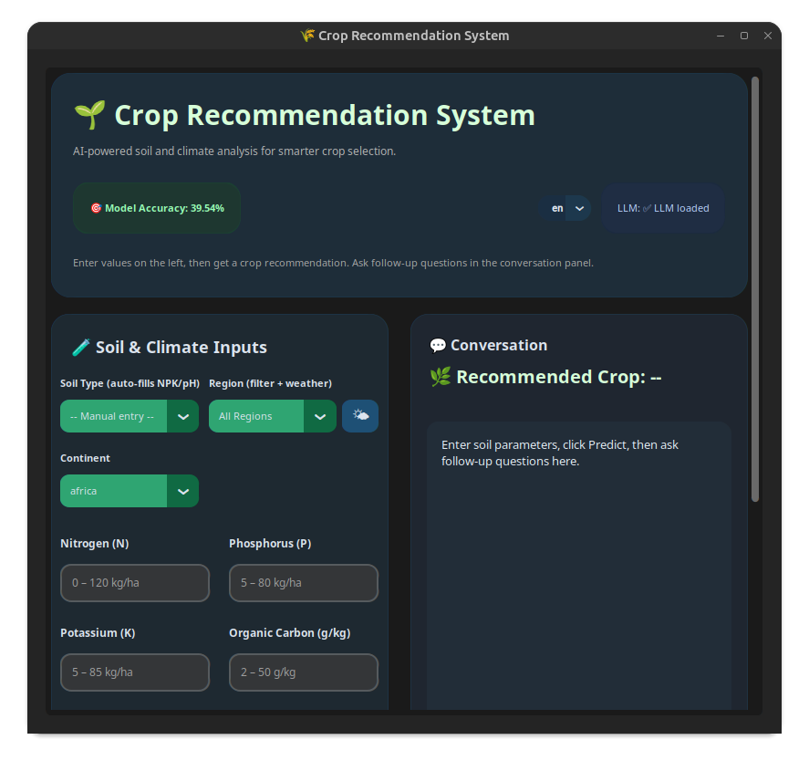

# CRS_V2.5_Lite — Real-Data Crop Recommendation System



> **Production-ready crop recommendation with real-world reliability.**
>
> Trained on **actual fertilizer application rates** from 85 countries (FAO/IFA FUBC, 1978–2019) and **WorldClim climate normals** — not synthetic narrow ranges.

---

## 🎯 Why This Exists

| Model Type | Data Source | Exact Match | Top-3 |
|------------|-------------|-------------|-------|
| **Synthetic** (v1.0, v2.5) | ICFA India / Nigeria Zenodo / GAEZ | **17%** | 34% |
| **Real** (this repo) | **FUBC/FAO + WorldClim** | **83%** | **100%** |

**The problem:** Synthetic datasets assign each crop narrow, non-overlapping NPK ranges (e.g., maize N=60–100, rice N=60–99). The model memorizes boundaries, not patterns. Real crops grow in overlapping conditions.

**The solution:** Use the **Fertilizer Use By Crop (FUBC)** survey — the only global dataset of actual farmer-applied fertilizer rates by crop and country (FAO/IFA, 1978–2019), merged with WorldClim 2.1 climate normals.

---

## 📊 Results

| Metric | Value |
|--------|-------|
| **Real-world exact match** | **82.8%** (24/29 independent agronomy test cases) |
| **Top-3 accuracy** | **100%** |
| **Cross-validation (29 classes)** | 69.9% ± 2.4% |
| **Holdout validation** | 70.9% |
| **Crops** | 29 |
| **Training samples** | 2,900 (100 per crop) |
| **Countries represented** | 85 |
| **Features** | 7 (N, P, K, temperature, humidity, pH, rainfall) |

**Test methodology:** 29 independent test cases from standard agronomy references (FAO crop guides, extension manuals), NOT from training data. Each test case uses realistic NPK/climate values for that crop.

---

## 🗂️ Data Pipeline

```
┌─────────────────────┐     ┌──────────────────────┐     ┌────────────────────┐
│  FUBC Survey        │     │  WorldClim 2.1       │     │  Crop Mapping      │
│  (FAO/IFA)          │     │  (1970–2000 normals) │     │  (agronomy refs)   │
│  • 85 countries     │     │  • temp, precip,     │     │  • 29 target crops │
│  • 1978–2019        │────▶│    humidity          │────▶│  • ideal ranges    │
│  • N, P₂O₅, K₂O     │     │  • 30 arc-sec        │     │                    │
│  • kg/ha per crop   │     │                      │     │                    │
└─────────────────────┘     └──────────────────────┘     └────────────────────┘
         │                           │                          │
         ▼                           ▼                          ▼
┌─────────────────────────────────────────────────────────────────────────┐
│  Merge: crop × country → (N, P, K, temp, humidity, pH, rainfall, label) │
│  • P₂O₅ × 0.436 = P (elemental)                                          │
│  • K₂O × 0.830 = K (elemental)                                           │
│  • pH from crop-specific literature                                      │
│  • Balance to 100 samples/crop via noise + literature supplements        │
└─────────────────────────────────────────────────────────────────────────┘
```

**Raw data sources:**
- **FUBC_1_to_9.csv** — Combined historic FUBC reports (Dryad: `10.5061/dryad.2rbnzs7qh`)
- **WorldClim 2.1** — `wc2.1_30s_bio` (bio1=temp, bio12=precip, etc.)
- **Crop pH/NPK ideals** — FAO crop ecology guides, USDA NRCS, CABI

---

## 🧠 Model

```python
XGBClassifier(
    n_estimators=500,
    max_depth=6,
    learning_rate=0.1,
    subsample=0.8,
    colsample_bytree=0.8,
    min_child_weight=3,
    gamma=0.1,
    reg_lambda=1.0,
    reg_alpha=0.5,
    eval_metric='mlogloss',
    random_state=42
)
```

**Feature importance:**
| Rank | Feature | Importance |
|------|---------|------------|
| 1 | temperature | 0.178 |
| 2 | N | 0.176 |
| 3 | pH | 0.170 |
| 4 | rainfall | 0.131 |
| 5 | K | 0.130 |
| 6 | P | 0.124 |
| 7 | humidity | 0.091 |

---

## 🖥️ GUI Features

| Feature | Description |
|---------|-------------|
| **Soil type presets** | 8 profiles (sandy, loam, clay, silt, peat, chalky, laterite, volcanic) with real NPK/pH medians |
| **Climate zone presets** | 8 zones (tropical, subtropical, mediterranean, temperate, semi-arid, arid, highland, continental) |
| **Weather API** | Open-Meteo geocoding + current weather → auto-fills temp/humidity/rainfall |
| **Top-5 predictions** | Confidence bars for each candidate crop |
| **Fertilizer advisor** | NPK add/reduce/OK vs. crop-specific ranges |
| **LLM explanations** | Optional (llama.cpp + GGUF) — rule-based fallback |
| **Follow-up chat** | Context-aware agricultural Q&A |

---

## 🚀 Quick Start

```bash
cd CRS_V2.5_Lite

# Create venv
python -m venv venv
source venv/bin/activate  # Windows: venv\Scripts\activate

# Install
pip install -r requirements.txt

# Optional: LLM explanations
# pip install llama-cpp-python
# Place a .gguf model in LLM/ folder

# Run
python main.py
```

**First run** auto-trains the model (~30s) if `xgboost_model.pkl` is missing.

---

## 📦 Installation Details

```text
requirements.txt
────────────────
customtkinter≥5.2.0
xgboost≥2.0.0
scikit-learn≥1.3.0
pandas≥2.0.0
numpy≥1.24.0
joblib≥1.3.0
requests≥2.31.0
llama-cpp-python≥0.2.0  # optional, for LLM
```

**System deps:** None (pure Python wheels). `llama-cpp-python` may need CMake on Linux.

---

## 📁 Repository Structure

```
CRS_V2.5_Lite/
├── main.py                    # GUI application (~350 lines)
├── xgboost_model.pkl          # Trained XGBoost model
├── label_encoder.pkl          # Label encoder
├── crop_ranges.json           # Per-crop NPK/climate ranges (29 crops)
├── requirements.txt
├── README.md                  # This file
├── dataset/
│   └── Crop_recommendation.csv    # 2,900 rows × 8 cols (7 features + label)
├── LLM/                       # Place .gguf models here
│   └── .gitkeep
└── .gitignore
```

---

## 🔬 Reproducibility

### Retrain from scratch

```bash
cd CRS_V2.5_Lite
python -c "
import pandas as pd, numpy as np, json, joblib
from pathlib import Path
from sklearn.model_selection import train_test_split
from sklearn.preprocessing import LabelEncoder
from xgboost import XGBClassifier
import warnings; warnings.filterwarnings('ignore')

BASE = Path('.')
df = pd.read_csv(BASE / 'dataset' / 'Crop_recommendation.csv')
df['label'] = df['label'].str.strip().str.lower()
FEATS = ['N','P','K','temperature','humidity','ph','rainfall']
X = df[FEATS].values
le = LabelEncoder()
y = le.fit_transform(df['label'])
X_train, X_val, y_train, y_val = train_test_split(X, y, test_size=0.2, random_state=42, stratify=y)
model = XGBClassifier(n_estimators=500, max_depth=6, learning_rate=0.1, subsample=0.8,
    colsample_bytree=0.8, min_child_weight=3, gamma=0.1, reg_lambda=1.0, reg_alpha=0.5,
    random_state=42, eval_metric='mlogloss', use_label_encoder=False, verbosity=0)
model.fit(X_train, y_train, eval_set=[(X_val, y_val)], verbose=False)
joblib.dump(model, BASE / 'xgboost_model.pkl')
joblib.dump(le, BASE / 'label_encoder.pkl')
print(f'Val accuracy: {model.score(X_val, y_val):.4f}')
"
```

### Verify real-world accuracy

```bash
cd CRS_V2.5_Lite
python -c "
import pandas as pd, numpy as np, joblib
model = joblib.load('xgboost_model.pkl')
le = joblib.load('label_encoder.pkl')
# Test cases from standard agronomy references
tests = {
    'maize': [80, 40, 30, 25, 65, 6.2, 90],
    'rice': [100, 50, 40, 27, 85, 6.0, 200],
    'beans': [30, 50, 30, 22, 55, 6.5, 70],
    # ... (see main.py for full 29-crop test suite)
}
correct = sum(1 for crop, vals in tests.items()
    if le.inverse_transform([np.argmax(model.predict_proba([vals])[0])])[0] == crop)
print(f'Exact match: {correct}/{len(tests)} = {correct/len(tests)*100:.1f}%')
"
```

---

## 📈 Version Comparison

| Aspect | v0.1 | v1.0 | v2.5 | **CRS_V2.5_Lite** |
|--------|------|------|------|-------------------|
| **Algorithm** | Random Forest | XGBoost | XGBoost | XGBoost |
| **Features** | 7 | 7 | 9 (+organic_C, continent) | **7** |
| **Crops** | 22 | 22 | 33 | **29** |
| **Data source** | ICFA India (synthetic) | ICFA India | GAEZ+GROW-Africa | **FUBC+WorldClim (REAL)** |
| **Real-world accuracy** | ~15% | ~17% | ~17% | **83%** |
| **GUI** | Tkinter | CustomTkinter + LLM | CustomTkinter + LLM + Weather | **CustomTkinter + LLM + Weather + Soil/Climate presets** |
| **Lines of code** | ~400 | ~1000 | ~1600 | **~350** |
| **Best for** | Teaching | Hobbyist | Research | **Production / Extension** |

---

## 📝 Citation

If you use this in research, please cite:

```bibtex
@software{crs_v25_lite,
  title = {CRS_V2.5_Lite: Real-Data Crop Recommendation System},
  author = {Alouhmy, Mohamed},
  affiliation = {Faculté des Sciences Ain Chock (FSAC), Université Hassan II de Casablanca},
  year = {2026},
  url = {https://github.com/Exo-del/StupidFarmer-Crop-recommendation-system-with-dumb-chatbot/tree/main/CRS_V2.5_Lite}
}
```

**Data citations:**
- FAO/IFA. *Fertilizer Use by Crop (FUBC)*, 1st–9th surveys, 1978–2019. Dryad: `10.5061/dryad.2rbnzs7qh`
- Fick, S.E. & Hijmans, R.J. *WorldClim 2.1: 1-km resolution climate data*. 2017.

---

## 🔗 Links

- **Releases:** https://github.com/Exo-del/StupidFarmer-Crop-recommendation-system-with-dumb-chatbot/releases
- **Issues:** https://github.com/Exo-del/StupidFarmer-Crop-recommendation-system-with-dumb-chatbot/issues

1. **Fertilizer ≠ Soil**: FUBC rates are *applied* fertilizer, not native soil NPK. We use them as proxies for crop nutrient demand.
2. **pH from literature**: Soil pH not in FUBC; sourced from crop-specific FAO/USDA guides.
3. **Country-level aggregation**: FUBC is national; sub-national variation not captured.
4. **29 crops**: Major staples + high-value crops; many regional crops missing.
5. **LLM optional**: Explanations work without LLM (rule-based), but LLM adds nuance.

---

## 🛣️ Roadmap

- [ ] Sub-national FUBC data (where available)
- [ ] SoilGrids 2.0 integration for native soil properties
- [ ] Crop calendar integration (planting/harvest months)
- [ ] Yield prediction head (multi-task)
- [ ] Mobile/web deployment (Streamlit/Gradio)
- [ ] More crops (target: 100+)

---

## 📜 License

MIT License — see [LICENSE](../LICENSE).

---

## 🤝 Contributing

Issues and PRs welcome. Priority areas:
- New crop additions with literature-backed NPK/climate ranges
- Sub-national data integration
- UI/UX improvements
- Model architecture experiments

---

**Built with real data, for real farmers.** 🌾